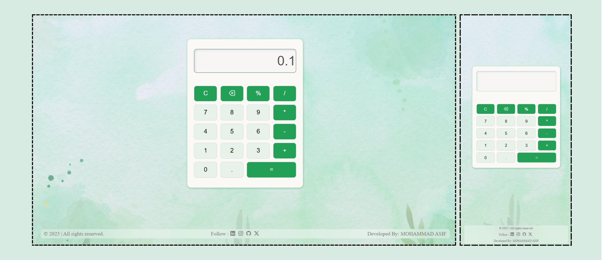

# 🧮 Simple Responsive Calculator

A modern, responsive calculator built using **HTML**, **CSS**, and **JavaScript**. This web-based calculator performs basic arithmetic operations and includes percentage handling, a polished UI, and mobile responsiveness.

🔗 **Go Live:** [https://calculator-mohammadasif34.netlify.app](https://calculator-mohammadasif34.netlify.app)

---

## ✨ Features

- Basic arithmetic: `+`, `-`, `×`, `÷`
- Percentage `%` operation support
- Input validation and error display
- Clear (`AC`) and Delete (`DEL`) functionality
- Animated UI with blurred background
- Fully responsive design (mobile-first)
- Elegant shadows and hover effects
- Footer with social links

---

## 📸 Preview



---

## 🛠️ Tech Stack

- **HTML5** – semantic layout
- **CSS3** – custom styling, grid layout, media queries
- **JavaScript** – app logic, display control, error handling
- **Netlify** – hosting and deployment

---

## 📂 Project Structure

```

/calculator
|
+---- assets/    # Backgrounds images and icons
|
+---- index.html    # Main HTML file
|
+---- style.css    # Styling CSS file
|
+---- app.js    # App logic define here
| 
+---- README.md    # Documentation

```

---

## 🚀 Getting Started

1. Clone the repository:
   ```bash
   git clone --branch "Calculator" https://github.com/MohammadAsif34/CodSoft.git
   cd calculator

---
## ✅ To-Do
- Add keyboard input support
- Improve accessibility (ARIA roles)
- Add scientific calculator functions (sqrt, sin, cos, etc.)
- Theme toggle (dark/light mode)
- Add transition animations on button clicks
 
---

## 📧 Contact
Made with ❤️ by Md Asif   
📧 mohammadasif34@gmail.com | 🌐 [Portfolio](https://portfolio-mohammadasif34.netlify.app/) | 🔗 [LinkedIn](https://www.linkedin.com/in/mohammadasif34) | 🐙 [GitHub](https://github.com/MohammadAsif34)  


