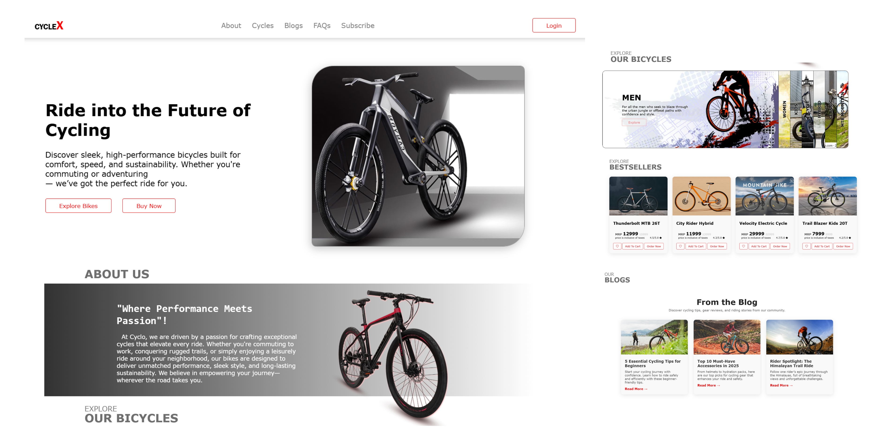

# 🚴 CycleX Landing Page
CycleX is a modern and responsive landing page designed for cycling enthusiasts and bike brands. It showcases high-performance bicycles, rider-focused features, and clean UI to elevate the user experience.

🔗 Go Live: (https://landingpage-mohammadasif34.netlify.app/)

# 📸 Preview
Landing Page Preview


# 🧾 About
This project showcases a professional single-page layout for a bicycle company, featuring:

- Hero section
- About section
- Product highlights
- Blog section
- Newsletter subscription
- Smooth scroll and animations
- Fully responsive design


# 🚀 Features
- HTML5 & CSS3
- Modern UI/UX design
- Scroll-based navigation
- Animated hover effects
- Newsletter subscription section
- Blog article cards


# 🛠️ Tech Stack
- HTML5 – semantic layout
- CSS3 – custom styling, grid layout
- JavaScript – app logic, display control, error handling
- Netlify – hosting and deployment


# 🛠️ Getting Started
To run this project locally:

1. Clone the repo:

  ```bash
  git clone --branch Landing_Page https://github.com/your-username/cycle-landing-page.git
  cd cycle-landing-page
  ```

# 📧 Contact
Made with ❤️ by Md Asif   
📧 mohammadasif34@gmail.com | 🌐 [Portfolio](https://portfolio-mohammadasif34.netlify.app/) | 🔗 [LinkedIn](https://www.linkedin.com/in/mohammadasif34) | 🐙 [GitHub](https://github.com/MohammadAsif34)  

